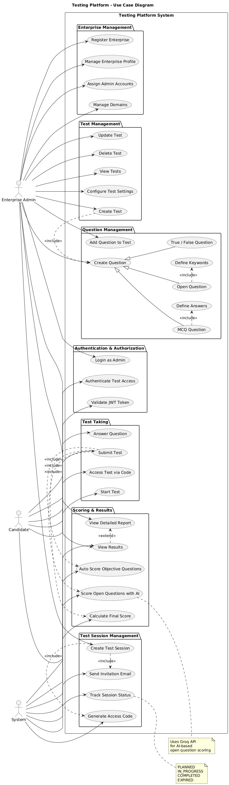
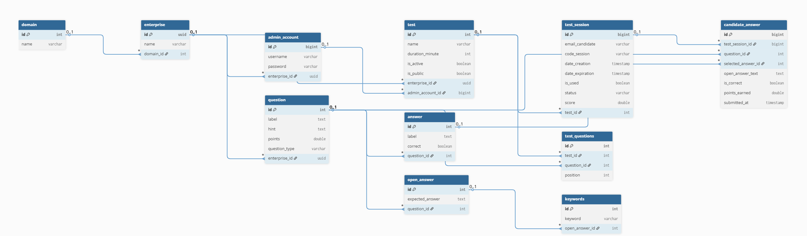
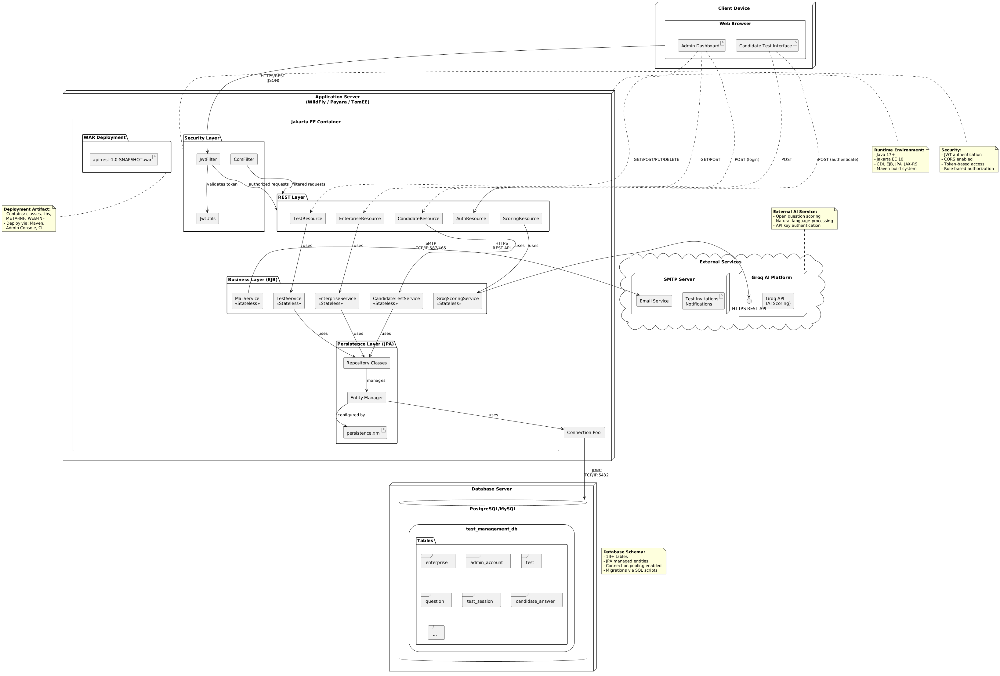

# SkillTest Pro – Full-Stack Application  
(Java EE / WildFly + React)

SkillTest Pro is a full-stack web application for managing online tests, candidate sessions,
and automated scoring.
The backend is built with **Java EE and WildFly**, while the frontend is developed using
**React** to provide a simple and responsive user interface.

---

## 🎥 Demo Video

  <a href="https://drive.google.com/file/d/1ZwVsnA0uiTOP3VdE9H1cWQ_Xcb6We7fX/view" target="_blank">
    ▶️ Watch Demo Video (3 min)
  </a>

[Demo](https://drive.google.com/file/d/1ZwVsnA0uiTOP3VdE9H1cWQ_Xcb6We7fX/view?usp=sharing)

---

## 🧩 System Architecture

---

## 🔄 Main Workflow

---

## ⚙️ Tech Stack
- Java EE (JPA, REST)
- WildFly
- PostgreSQL
- JWT Authentication
- Mail Service
- groq

---

## 📘 Technical Documentation
- [WildFly Datasource Configuration](backend/wildfly/datasource.md)
